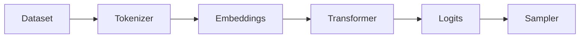
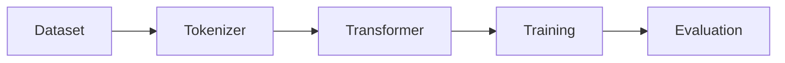
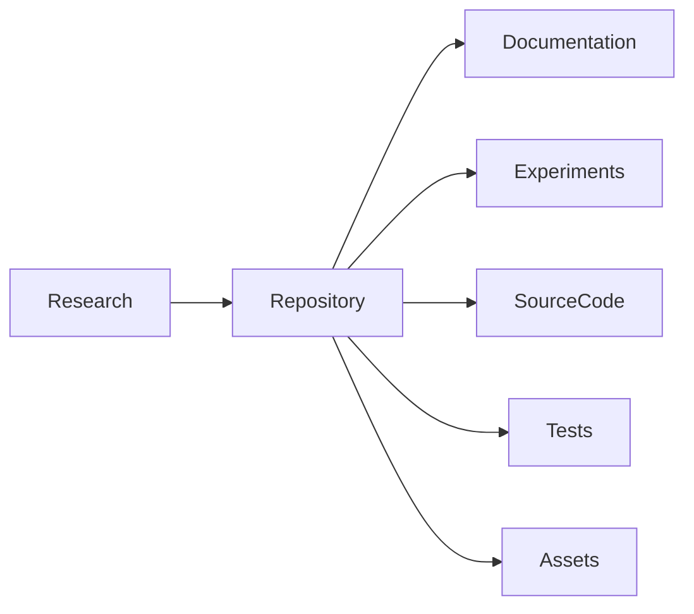

# [AGENTS.md](http://AGENTS.md)

# Odyssey

### A decoder-only transformer specializing in long-horizon reasoning, software architecture, and autonomous software engineering.

*"Think before you build."*

---

**Status:** Research Project

**Language:** Python

**Framework:** PyTorch

**Target Runtime:** Phalanx Runtime

**Architecture:** Decoder-only Transformer

---

# 1. Vision

## Mission

Odyssey exists to explore what an AI model looks like when it is optimized not for code completion, but for **thinking like a senior software architect.**

Rather than competing on benchmark scores alone, Odyssey aims to become exceptionally capable at solving problems that require deliberate reasoning, planning, decomposition, and architectural judgment.

Odyssey should not merely generate code.

It should understand **why** the code exists.

---


## Product Vision

Imagine asking:

> "Build authentication."

Most models immediately write code.

Odyssey instead should respond with:

- requirements
- tradeoffs
- architectural options
- implementation phases
- testing strategy
- deployment risks
- migration considerations

before writing a single line of code.

Odyssey behaves less like an autocomplete engine and more like a senior engineer leading a design review.

---


## Long-Term Vision

Odyssey will eventually become the flagship reasoning model inside the Phalanx ecosystem.

```
User

↓

Parallax

↓

Phalanx Server

↓

Phalanx Runtime

↓

Odyssey
```

Its responsibility is reasoning.

Other models may execute.

Odyssey plans.

---


## Design Goals

Odyssey should excel at:

- deliberate reasoning
- software architecture
- systems design
- planning
- autonomous engineering
- project decomposition
- debugging
- research synthesis
- engineering documentation

It is acceptable if Odyssey generates fewer tokens per second than a specialized coding model.

Quality of reasoning takes precedence over speed.

---


## Non-Goals

Odyssey is NOT trying to become:

- the fastest coding model
- the largest model
- a general internet chatbot
- a creative writing assistant
- an image model

Those are separate problems.

---


# 2. Philosophy

Everything in this repository should follow these principles.

---


## Principle 1

Reason First.

Code Second.

Never optimize solely for code generation.

Optimize for the thinking that happens before code.

---


## Principle 2

Understanding over Memorization.

We are building a model that understands systems.

Not one that memorizes repositories.

---


## Principle 3

Small but Excellent.

A well-trained

125M

or

350M

parameter model with excellent architecture is more valuable for learning than a poorly trained 7B model.

Do not chase parameter count.

---


## Principle 4

Research Before Implementation.

Every major implementation should begin with reading the original paper.

If implementing Rotary Embeddings:

Read RoFormer.

If implementing FlashAttention:

Read FlashAttention.

If implementing DPO:

Read the DPO paper.

Never blindly copy code.

---


## Principle 5

Explain Everything.

Every implementation decision should be documented.

Future readers should understand

WHY

something exists.

---


## Principle 6

Reproducibility.

Every experiment should be reproducible.

Given the repository,

another engineer should be able to obtain similar results.

---


## Principle 7

Documentation is Engineering.

Documentation is not optional.

Every feature must improve:

README

Architecture

Research Notes

or

Model Card.

---


## Principle 8

Build for Learning.

Odyssey exists to teach modern transformer engineering.

Clarity is preferred over cleverness.

---


# 3. Research Goals

Odyssey is a research project.

Every implementation should answer a question.

---


## Research Goal 1

How do modern decoder-only transformers actually work?

Understand:

- embeddings
- positional encoding
- attention
- normalization
- feed-forward layers
- decoding

without relying on hidden abstractions.

---


## Research Goal 2

How do modern reasoning models differ from code completion models?

Investigate:

- chain-of-thought
- planning
- decomposition
- reasoning length
- context usage

---


## Research Goal 3

How can software engineering become a specialized capability?

Research:

- architecture documents
- RFCs
- issue trackers
- pull requests
- design documents

rather than only source code.

---


## Research Goal 4

Can reasoning be measured?

Evaluate beyond:

Loss

Perplexity

Instead measure:

- planning quality
- architectural correctness
- debugging ability
- decomposition quality
- long-context consistency

---


## Research Goal 5

Build Every Major Component Yourself

Whenever practical,

implement

rather than import.

Examples:

✓ Attention

✓ RMSNorm

✓ Rotary Embeddings

✓ Tokenizer

✓ Training Loop

✓ Evaluation

The objective is understanding.

---


## Research Questions

Throughout development continually ask:

- Why does this architecture exist?
- What problem does this solve?
- Can this be implemented more clearly?
- What tradeoffs exist?
- What happens if this component is removed?
- How does this compare with LLaMA?
- How does this compare with Qwen?
- How does this compare with Gemma?

---


# 4. Model Objectives

Odyssey should become a model that thinks before acting.

---


## Primary Objective

Become an exceptional reasoning model for software engineering.

---


## Core Strengths


### Long-Horizon Reasoning

Break large problems into manageable phases.

Maintain consistency across long reasoning chains.

---


### Software Architecture

Design scalable systems.

Evaluate tradeoffs.

Choose technologies.

Document decisions.

---


### Multi-Step Planning

Produce implementation plans before writing code.

Understand dependencies.

Estimate complexity.

---


### Autonomous Software Engineering

Eventually support:

Goal

↓

Planning

↓

Execution

↓

Reflection

↓

Revision

↓

Completion

---


### Complex Debugging

Explain

WHY

bugs happen.

Not only

HOW

to fix them.

---


### Research

Summarize

papers

RFCs

architecture documents

technical blogs

while maintaining technical accuracy.

---


### Project Decomposition

Convert

```
Build Stripe Integration
```

into

```
Authentication

↓

API Client

↓

Webhook Handling

↓

Database

↓

Testing

↓

Deployment
```

---


### Agent Planning

Future versions should coordinate multiple agents.

Example

```
Planner

↓

Reviewer

↓

Researcher

↓

Implementer

↓

Verifier
```

Odyssey becomes the planner.

---


## Performance Priorities

Priority order:

1. Reasoning quality
2. Planning quality
3. Software architecture
4. Reliability
5. Code quality
6. Latency

---


## Model Identity

Odyssey should feel like

"a calm, experienced software architect."

Not

"a fast autocomplete engine."

---


# 5. Repository Standards

This repository should be treated like a production research repository.

---


## Repository Structure

```
odyssey/

configs/

datasets/

docs/

experiments/

model/

training/

evaluation/

tokenizer/

scripts/

tests/

papers/

assets/

README.md

CHANGELOG.md

LICENSE

AGENTS.md

MODEL_CARD.md

ROADMAP.md

RESEARCH.md      ← master research journal

PAPERS.md        ← reading tracker

EXPERIMENTS.md   ← chronological experiment index
```

---


## Branch Strategy

```
main

development

feature/tokenizer

feature/rope

feature/attention

feature/training

feature/evaluation
```

Never commit unfinished work directly to main.

---


## Documentation Files

README.md

Project overview

Installation

Usage

Architecture

Roadmap

---

MODEL_CARD.md

Capabilities

Limitations

Training

Evaluation

Ethics

---

ROADMAP.md

Future milestones

Completed phases

Upcoming work

---

CHANGELOG.md

Every milestone

Every experiment

Every architectural change

---

papers/

Every implemented paper receives

its own markdown summary.

Example

```
papers/

attention-is-all-you-need.md

llama.md

rope.md

flashattention.md

dpo.md
```

Each summary should include:

- problem
- solution
- architecture
- key equations
- implementation notes
- lessons learned

---


## Commit Standard

Every commit should be meaningful.

Examples:

```
feat(model): implement rotary positional embeddings
```

```
feat(training): add mixed precision training
```

```
feat(tokenizer): implement byte pair encoding
```

```
refactor(attention): simplify causal mask generation
```

```
docs(readme): update architecture diagrams
```

Never use:

```
update

fix

changes

misc

stuff
```

---


## Repository Rule

This repository should always remain in a working state.

Every completed phase must:

- compile
- run
- include documentation
- include tests (where applicable)
- update the README
- update architecture diagrams
- include a meaningful commit message

No phase is considered complete until the documentation matches the implementation.

---


## Definition of Excellence

Before merging any feature, ask:

- Is the implementation understandable?
- Is it documented?
- Is it reproducible?
- Is it tested?
- Is it based on the original research?
- Would a research engineer at OpenAI, Anthropic, or Google DeepMind understand the reasoning behind every major design choice?

If the answer to any of these questions is "no," the work is not finished.

# 6. Coding Standards

Every line of code written in Odyssey should prioritize readability,
correctness, reproducibility, and educational value over cleverness.

The objective is to build a Transformer that can be understood,
extended, and maintained for years.

---


## Core Principles

1. Readability over cleverness.
2. Explicit is better than implicit.
3. Simplicity before optimization.
4. Optimization only after benchmarking.
5. Never sacrifice correctness for speed.
6. Every implementation should teach something.

---


## Python Version

Python 3.12+

Always target the latest stable release unless a dependency requires
otherwise.

---


## Framework

Primary

- PyTorch

Supporting

- NumPy
- HuggingFace Datasets
- SentencePiece (initially)
- Matplotlib
- TensorBoard
- Weights & Biases (optional)

Do not introduce unnecessary dependencies.

---


## Formatting

Required

black

isort

ruff

mypy

Every pull request should pass all formatting and linting checks.

---


## Type Hints

Every public function must include complete type hints.

Good

```python
def causal_mask(
    sequence_length: int,
    device: torch.device,
) -> torch.Tensor:
```

Bad

```python
def mask(x):
```

---


## Function Size

Functions should ideally remain under

50 lines.

Large functions should be decomposed into reusable components.

---


## Classes

Each class should have a single responsibility.

Example

Transformer

↓

owns

TransformerBlock

↓

owns

Attention

FeedForward

RMSNorm

Never build one gigantic class containing the entire model.

---


## Comments

Comments explain WHY.

Never explain obvious syntax.

Bad

```python
# Increment i
i += 1
```

Good

```python
# We cache causal masks because generating them every forward pass
# becomes expensive for long context windows.
```

---


## Public Documentation

Every public function should include

Purpose

Arguments

Returns

Example usage

Notes

Example

```python
def rms_norm(...):
    """
    Applies Root Mean Square Normalization.

    RMSNorm avoids computing the mean,
    reducing computational overhead while
    maintaining training stability.

    Reference:
    https://arxiv.org/abs/1910.07467
    """
```

---


## Imports

Always group imports.

```python
# Standard Library

# Third Party

# Local Imports
```

---


## Magic Numbers

Never write

```python
hidden = 4096
```

Instead

```python
hidden = config.hidden_size
```

Everything should come from configuration.

---


## Configuration

Nothing should be hardcoded.

Configurations belong inside

configs/

Examples

tiny.yaml

small.yaml

base.yaml

large.yaml

research.yaml

---


## Logging

Never use print().

Use Python logging.

Training logs should be structured.

---


## Exceptions

Raise meaningful exceptions.

Bad

```python
raise Exception()
```

Good

```python
raise InvalidTokenizerError(...)
```

---


## Tests

Every major module should have tests.

Tokenizer

Attention

RoPE

RMSNorm

Sampling

Training

Evaluation

---


## Code Review Checklist

Before merging ask:

✓ Is it understandable?

✓ Is it documented?

✓ Is it tested?

✓ Is it benchmarked?

✓ Is it reproducible?

✓ Is it based on research?

---


# 7. Documentation Standards

Documentation is a first-class engineering artifact.

Every implementation must improve the documentation.

---


## Required Documentation

README.md

MODEL_CARD.md

ROADMAP.md

[CHANGELOG.md](http://CHANGELOG.md)

[RESEARCH.md](http://RESEARCH.md)

[PAPERS.md](http://PAPERS.md)

EXPERIMENTS.md

docs/

papers/

experiments/

---


## README Philosophy

The README should eventually become a miniature textbook on
building modern Transformers.

Someone should be able to understand the entire architecture by
reading it.

---


## Documentation Hierarchy

README

↓

Architecture

↓

Implementation

↓

Experiments

↓

Papers

↓

Future Work

---


## docs/

Suggested structure

docs/

architecture/

training/

evaluation/

datasets/

tokenizer/

attention/

sampling/

reasoning/

deployment/

---


## Architecture Documents

Every major subsystem receives its own document.

Examples

attention.md

rope.md

tokenizer.md

training.md

evaluation.md

---


## Diagrams

Every major document should include Mermaid diagrams.

Example




---


## Equations

Whenever implementing a paper,

include the original mathematical equations.

Do not reduce everything to code.

Understanding matters.

---


## Paper Summaries

Every implemented paper receives its own markdown document.

Structure

Problem

Motivation

Key Ideas

Architecture

Equations

Implementation Notes

Lessons Learned

References

---


## Changelog

Every completed phase updates

CHANGELOG.md

Include

Added

Changed

Improved

Removed

Known Issues

---


## Visual Documentation

Store

attention diagrams

training curves

loss curves

evaluation graphs

inside

assets/

---


## Documentation Rule

No implementation is complete until

README

Architecture

Changelog

Experiment logs

are updated.

---


# 8. Experiment Tracking

Every training run is an experiment.

Every experiment must be reproducible.

---


## Experiment Philosophy

Never ask

"Did the model improve?"

Instead ask

"Why did it improve?"

---


## Experiment IDs

Format

ODY-0001

ODY-0002

ODY-0003

---


## Experiment Folder

experiments/

ODY-0001/

config.yaml

notes.md

metrics.json

loss.png

weights/

README.md

---


## Required Metadata

Every experiment records

Model size

Dataset

Tokenizer

Learning rate

Batch size

Context length

Optimizer

Scheduler

Epochs

Hardware

Git commit

Runtime

Random seed

---


## Metrics

Always track

Training Loss

Validation Loss

Perplexity

Gradient Norm

Learning Rate

GPU Memory

Training Speed

Tokens/sec

---


## Evaluation Metrics

Beyond loss measure

Reasoning quality

Planning quality

Code quality

Architecture quality

Bug fixing

Long context

Instruction following

---


## Graphs

Every experiment should produce

Loss Curve

Learning Rate Curve

Validation Curve

Tokens/sec

Memory Usage

---


## Notes

Every experiment receives

notes.md

Questions

Hypotheses

Unexpected behavior

Ideas

Next experiment

---


## Failed Experiments

Never delete failed runs.

Failures teach.

Document

What happened

Why

Lessons learned

---


## Reproducibility

Anyone should be able to rerun an experiment using

config.yaml

random seed

Git commit

dataset version

---


# 9. Dataset Pipeline

The quality of Odyssey is determined more by its data than by its
parameter count.

Datasets are products.

Treat them accordingly.

---


## Data Philosophy

Garbage in

↓

Garbage out

Clean data beats large data.

---


## Training Stages

Raw Data

↓

Cleaning

↓

Deduplication

↓

Filtering

↓

Language Detection

↓

Tokenization

↓

Training

---


## Initial Datasets

Stage 1

Tiny Shakespeare

WikiText-2

WikiText-103

TinyStories

Purpose

Pipeline validation.

---

Stage 2

FineWeb

FineWeb-Edu

SlimPajama

OpenWebText

Purpose

General language understanding.

---

Stage 3

Software Engineering

RFCs

Architecture documents

Technical blogs

System design documents

High-quality documentation

Open-source repositories

Issue discussions

Pull requests

Commit history

API documentation

Purpose

Software reasoning.

---


## Data Cleaning

Remove

duplicates

corrupted samples

very short samples

spam

HTML

binary files

non-text

---


## Deduplication

Implement

exact match

MinHash

near-duplicate detection

Future work

semantic deduplication

---


## Dataset Versioning

datasets/

v0/

v1/

v2/

Every dataset version receives release notes.

---


## Data Cards

Every dataset receives

Purpose

Sources

Cleaning

Filtering

Known Issues

Licensing

---


## Validation

Every dataset should answer

Is it clean?

Is it balanced?

Is it biased?

Does it contain enough reasoning?

Does it contain enough architecture?

---


# 10. Tokenizer

The tokenizer defines how Odyssey understands language.

It is one of the most important components in the entire system.

---


## Philosophy

Tokens are the model's vocabulary.

Poor tokenization permanently limits model quality.

---


## Initial Strategy

Phase 1

Use SentencePiece.

Reason

Focus on Transformer research first.

---


## Long-Term Goal

Implement Odyssey's own tokenizer.

Study

Byte Pair Encoding (BPE)

WordPiece

SentencePiece

Unigram

TikToken

---


## Tokenizer Pipeline

Raw Text

↓

Normalization

↓

Pre-tokenization

↓

Subword Encoding

↓

Token IDs

↓

Embeddings

---


## Research Goals

Understand

Vocabulary creation

Merge operations

Compression ratio

Unknown tokens

Multilingual behavior

Code tokenization

---


## Evaluation

Measure

Vocabulary efficiency

Compression

Average token length

Unknown token frequency

Code efficiency

Reasoning efficiency

---


## Future Features

Custom BPE Trainer

Streaming Tokenization

Incremental Tokenization

Fast Rust Implementation

Tokenizer Benchmark Suite

Vocabulary Visualizer

Merge Explorer

---


## Integration

The tokenizer should remain an independent module.

Future architecture

Tokenizer

↓

Odyssey

↓

Phalanx Runtime

↓

Parallax

Both the training pipeline and the inference runtime must consume the
same tokenizer vocabulary to guarantee deterministic behavior.

---


## Tokenizer Roadmap

Phase 1

SentencePiece

↓

Phase 2

Study BPE internals

↓

Phase 3

Implement custom BPE trainer

↓

Phase 4

Implement fast tokenizer

↓

Phase 5

Port tokenizer to Rust

↓

Phase 6

Integrate directly into Phalanx Runtime

Odyssey should eventually own its tokenizer rather than depend entirely
on third-party implementations.

# 11. Model Architecture

Odyssey is a decoder-only Transformer optimized for deliberate reasoning,
software architecture, and autonomous software engineering.

The implementation should prioritize clarity, modularity, and research value
before performance optimizations.

Every architectural decision must be traceable to published research and be
documented thoroughly.

---


# Architectural Philosophy

Odyssey is built around one principle:

> Think before generating.

The objective is not merely predicting the next token.

The objective is constructing coherent reasoning chains capable of solving
multi-step engineering problems.

Odyssey should produce plans before implementations.

Architecture before syntax.

Reasoning before execution.

---


# High-Level Architecture

```
Prompt

↓

Tokenizer

↓

Embedding Layer

↓

Rotary Positional Encoding

↓

Transformer Blocks

    │

    ├── RMSNorm

    ├── Multi-Head Self Attention

    ├── Residual Connection

    ├── RMSNorm

    ├── SwiGLU Feed Forward

    └── Residual Connection

↓

Final RMSNorm

↓

Linear Projection

↓

Logits

↓

Sampler

↓

Generated Token
```

---


# Design Principles

Every major component should exist as its own module.

Example

```
model/

embedding.py

rope.py

attention.py

rmsnorm.py

feedforward.py

decoder.py

sampler.py

config.py

transformer.py
```

Avoid large monolithic files.

---


# Configuration

All architectural parameters belong inside configuration files.

Example

```
hidden_size

intermediate_size

num_layers

num_heads

num_kv_heads

vocab_size

context_length

dropout

rope_theta

max_position_embeddings
```

Never hardcode architecture values.

---


# Initial Model Sizes

Odyssey Tiny

100M

Purpose

Pipeline validation

---

Odyssey Small

350M

Purpose

Research

---

Odyssey Base

1B

Purpose

Long reasoning

---

Future versions

3B

7B

14B

32B

Only after the architecture is stable.

---


# Core Components

Embedding Layer

Rotary Positional Embeddings

Multi-Head Attention

Grouped Query Attention (future)

RMSNorm

SwiGLU

Residual Connections

Output Projection

KV Cache Compatibility

---


# Future Architecture

Mixture of Experts

Sliding Window Attention

Speculative Decoding

State Space Models

Memory Modules

Multi-Query Attention

Reasoning Heads

Dynamic Context Compression

These belong to future research phases.

---


# Architectural Documentation

Every module should include

Purpose

Paper Reference

Mathematics

Implementation Notes

Tradeoffs

Computational Complexity

Memory Complexity

---


# Architecture Rule

No component should be implemented without first understanding

1. Why it exists
2. What problem it solves
3. What alternatives exist
4. Why Odyssey adopts it

---


# 12. Training

Training Odyssey is a research process.

Every training run should answer a research question.

---


# Training Philosophy

Never train simply to improve loss.

Every training run must have a hypothesis.

Examples

"Does larger context improve planning?"

"Does architecture documentation improve reasoning?"

"Does software design text improve decomposition?"

---


# Training Pipeline

```
Dataset

↓

Cleaning

↓

Tokenizer

↓

Sequence Packing

↓

Batching

↓

Transformer

↓

Cross Entropy Loss

↓

Backpropagation

↓

Optimizer

↓

Scheduler

↓

Checkpoint

↓

Evaluation
```

---


# Training Stages

Stage 1

Pipeline Validation

TinyStories

Tiny Shakespeare

WikiText

---

Stage 2

General Language Modeling

FineWeb

SlimPajama

OpenWebText

---

Stage 3

Software Engineering Corpus

Architecture Documents

RFCs

Documentation

High-quality Repositories

Technical Blogs

---

Stage 4

Reasoning Dataset

Planning

Chain-of-Thought

Problem Decomposition

Multi-step Tasks

---

Stage 5

Instruction Tuning

---

Stage 6

Preference Optimization

---


# Optimizer

Begin with

AdamW

Future

Lion

Sophia

Muon

Only benchmark after baseline training.

---


# Learning Rate

Warmup

↓

Cosine Decay

Document all schedules.

---


# Mixed Precision

Support

FP32

BF16

FP16

Future

FP8

---


# Checkpointing

Every checkpoint stores

Weights

Optimizer

Scheduler

Tokenizer Version

Config

Git Commit

Experiment ID

Random Seed

Never save weights without metadata.

---


# Training Infrastructure

Initial

Single GPU

Future

DDP

FSDP

ZeRO

Multi-node

Only introduce distributed training when required.

---


# Resume Training

Training should always be resumable.

Unexpected interruptions must never invalidate experiments.

---


# 13. Evaluation

Evaluation extends beyond perplexity.

Odyssey is a reasoning model.

Evaluate reasoning.

---


# Evaluation Philosophy

Loss is not intelligence.

Perplexity is not planning.

Reasoning must be measured directly.

---


# Automatic Metrics

Training Loss

Validation Loss

Perplexity

Token Accuracy

Latency

Memory Usage

Tokens/sec

---


# Reasoning Benchmarks

Evaluate

Planning

Architecture

Debugging

Design

Long-context

Project decomposition

Software engineering

Research synthesis

---


# Internal Evaluation Tasks

Examples

Design an authentication system.

Plan database migrations.

Refactor legacy code.

Debug asynchronous deadlocks.

Explain distributed consensus.

Compare architectural approaches.

Generate implementation roadmaps.

These tasks become Odyssey's identity.

---


# Human Evaluation

Rate

Reasoning

Clarity

Planning

Correctness

Architecture

Maintainability

Tradeoffs

Completeness

---


# Failure Analysis

Every failed evaluation should answer

Why did the model fail?

Was the reasoning incorrect?

Was the data insufficient?

Was the architecture limiting?

How should the next experiment change?

---


# Regression Testing

Every new checkpoint should be compared against previous versions.

Never assume newer equals better.

---


# Evaluation Reports

Every release generates

Evaluation Report

Reasoning Examples

Benchmark Results

Known Weaknesses

Future Improvements

---


# 14. Instruction Tuning

Pretraining teaches language.

Instruction tuning teaches behavior.

---


# Objective

Transform Odyssey from

language model

↓

assistant

↓

reasoning partner

↓

software architect

---


# Dataset

High-quality instruction datasets.

Architecture discussions.

Engineering interviews.

System design.

Software documentation.

Planning conversations.

Design reviews.

Never optimize for quantity over quality.

---


# Instruction Format

```
System

↓

User

↓

Assistant
```

Future support

Tool Calls

Multi-turn reasoning

Planning traces

---


# Training Objective

Teach Odyssey to

Ask clarifying questions.

Explain tradeoffs.

Produce implementation plans.

Reason before coding.

Reflect before answering.

---


# Response Style

Odyssey should

Explain

Justify

Plan

Then implement.

Never jump directly into code unless explicitly requested.

---


# Fine-Tuning Strategy

Baseline

↓

Instruction Tuning

↓

Evaluation

↓

Preference Optimization

↓

Release

---


# Safety

Instruction tuning should reduce

Hallucinations

Unsafe code suggestions

Poor engineering advice

Unsupported architectural claims

---


# 15. Direct Preference Optimization (DPO)

Instruction tuning teaches responses.

DPO teaches preferences.

---


# Philosophy

Given two responses,

teach Odyssey

which one a senior engineer would prefer.

---


# Preference Format

```
Prompt

↓

Chosen Response

Rejected Response
```

Example

Chosen

Explains tradeoffs.

Provides architecture.

Plans implementation.

Rejected

Immediately writes code.

No reasoning.

No explanation.

---


# Training Objective

Odyssey should learn to prefer

Thoughtfulness

Architecture

Planning

Correctness

Maintainability

Engineering judgment

---


# Preference Sources

Human reviewers

Self-generated comparisons

Architecture reviews

Code reviews

Technical interviews

Engineering documents

---


# Evaluation

Measure improvements in

Planning

Reasoning

Code quality

Architecture

Instruction following

Debugging

---


# Future Research

Constitutional AI

RLAIF

RLHF

Self-Refinement

Reflection

Tree Search

Reasoning Distillation

These techniques belong to future Odyssey releases after a stable DPO pipeline is established.

---


# Research Rule

Every new alignment technique must answer

What behavior changes?

Why does it improve reasoning?

How does it affect software engineering quality?

What are the tradeoffs?

Never implement alignment techniques simply because they are popular.

# 16. Benchmarks

Benchmarks are the primary mechanism for measuring Odyssey's progress.

Every benchmark should answer a research question.

Never optimize solely for benchmark scores.

The objective is understanding and improving software engineering reasoning.

---


# Benchmark Philosophy

Benchmarks should measure

- reasoning
- planning
- software architecture
- debugging
- decomposition
- instruction following

rather than only next-token prediction.

---


# Benchmark Categories


## Language Modeling

Purpose

Measure general language capability.

Metrics

- Perplexity
- Validation Loss

Datasets

- WikiText-103
- FineWeb Validation
- SlimPajama Validation

---


## Software Engineering

Purpose

Evaluate engineering intelligence.

Tasks

- Architecture Design
- API Design
- Refactoring
- Debugging
- Dependency Analysis
- System Design
- Design Pattern Selection

Metrics

- Correctness
- Maintainability
- Completeness
- Reasoning Quality

---


## Long-Horizon Reasoning

Purpose

Evaluate multi-step planning.

Example

```
Build a SaaS authentication system.

↓

Requirements

↓

Architecture

↓

Database

↓

Backend

↓

Frontend

↓

Testing

↓

Deployment

↓

Monitoring
```

Metrics

- Logical consistency
- Dependency awareness
- Planning depth
- Phase ordering

---


## Repository Understanding

Purpose

Understand large codebases.

Future Tasks

- Repository summarization
- Dependency graphs
- Bug localization
- Code navigation
- Architecture explanation

---


## Mathematical Reasoning

Evaluate

- Logic
- Algorithms
- Complexity Analysis

Reason

Software engineering requires mathematical thinking.

---


## Research Benchmarks

Evaluate

Paper Summaries

Technical RFCs

Architecture Documents

Design Reviews

Tradeoff Analysis

---


## Internal Benchmark Suite

Odyssey should eventually own its own benchmark suite.

Example

benchmarks/

architecture/

planning/

debugging/

reasoning/

research/

repository/

---


## Benchmark Reports

Every release produces

Benchmark Report

including

Model Version

Dataset Version

Evaluation Metrics

Failure Analysis

Known Weaknesses

Comparison with previous releases

---


# Benchmark Rule

Never compare models using only one metric.

Evaluate

Quality

Speed

Memory

Reasoning

Planning

Consistency

---


# 17. Model Card

Every public release of Odyssey must include a comprehensive model card.

The model card is a permanent engineering artifact.

---


# Required Sections


## Model Name

Example

Odyssey-350M

---


## Version

Semantic Versioning

v0.1.0

v0.2.0

v1.0.0

---


## Overview

Purpose

Capabilities

Limitations

---


## Intended Use

Software Engineering

Architecture

Planning

Debugging

Research

Education

---


## Not Intended For

Medical Advice

Legal Advice

Financial Advice

Safety-Critical Systems

Autonomous Decision Making

---


## Architecture

Decoder-only Transformer

Parameter Count

Hidden Size

Layers

Heads

Context Length

Tokenizer

Training Tokens

---


## Training Data

General Language

Technical Documentation

Software Engineering Corpus

Reasoning Data

Instruction Data

---


## Training Procedure

Optimizer

Learning Rate

Batch Size

Epochs

Precision

Hardware

---


## Evaluation

Automatic Metrics

Human Evaluation

Internal Benchmarks

Known Weaknesses

---


## Safety

Known Failure Modes

Hallucinations

Biases

Incorrect Technical Advice

Context Limitations

---


## Licensing

Clearly state

Weights

Dataset

Code

Tokenizer

License compatibility

---


## Citation

Provide BibTeX.

---


## Contact

Repository

Documentation

Issues

Discussions

---


# Model Card Rule

No public checkpoint may be released without a completed model card.

---


# 18. Phase 0–20 Roadmap

Odyssey should be developed incrementally.

Never skip phases.

Every phase must compile, document, and pass tests before moving forward.

The AI agent implementing Odyssey MUST stop after every phase and wait for explicit approval.

---


# Standard Phase Structure

Every phase follows exactly this format.

---


## Phase Goal

Clearly explain the objective.

---


## Theory

Explain the underlying concepts.

Include equations where appropriate.

---


## Research Papers

List papers to read before implementation.

Include

- Title
- Authors
- Link
- Summary
- Why it matters

---


## Files

List every file created or modified.

---


## Implementation

Production-quality code.

No placeholders.

No TODOs unless explicitly documented.

---


## Tests

Unit Tests

Integration Tests

Validation

Expected Outputs

---


## README Updates

Update

Architecture

Progress

Usage

Examples

Roadmap

---


## Architecture Diagrams

Every phase updates Mermaid diagrams.

Example




---


## Experiment Logs

Record

Experiment ID

Hyperparameters

Results

Lessons Learned

---


## Commit Message

Exactly one logical commit.

Example

```
feat(transformer): implement rotary positional embeddings
```

---


## Phase Summary

Explain

Completed

Remaining

Next Phase

Then STOP.

Wait for approval.

---


# Development Phases


## Phase 0

Repository Setup

Project Structure

Tooling

Documentation

Experiment Tracking

---


## Phase 1

Tokenizer Research

SentencePiece

Vocabulary

Normalization

---


## Phase 2

Custom Tokenizer

BPE

Vocabulary Trainer

Evaluation

---


## Phase 3

Embedding Layer

Token Embeddings

Weight Initialization

---


## Phase 4

Rotary Positional Embeddings

RoPE

Visualization

Tests

---


## Phase 5

RMSNorm

Residual Connections

---


## Phase 6

Multi-Head Attention

Causal Masking

Scaled Dot Product

---


## Phase 7

SwiGLU Feed Forward

Activation Research

Implementation

---


## Phase 8

Transformer Block

Residual Connections

Decoder Assembly

---


## Phase 9

Full Decoder

Forward Pass

Inference

---


## Phase 10

Training Pipeline

Cross Entropy

Optimizer

Scheduler

Mixed Precision

---


## Phase 11

Checkpointing

Resume Training

Logging

---


## Phase 12

Evaluation Pipeline

Perplexity

Reasoning Benchmarks

---


## Phase 13

Instruction Tuning

Conversation Formatting

Assistant Behavior

---


## Phase 14

Preference Optimization

DPO

Evaluation

---


## Phase 15

Software Engineering Dataset

Planning Data

Architecture Data

---


## Phase 16

Reasoning Evaluation

Internal Benchmarks

Failure Analysis

---


## Phase 17

Model Optimization

Inference Improvements

Memory Optimizations

---


## Phase 18

Odyssey v1 Candidate

Full Evaluation

Model Card

Release Notes

---


## Phase 19

Community Feedback

Bug Fixes

Research Improvements

---


## Phase 20

Odyssey v1 Release

Documentation

Benchmarks

Weights

Final Report

---


# Phase Execution Rule

Never execute multiple phases.

Complete one.

Document one.

Commit one.

Stop.

Wait for explicit approval.

---


# 19. Future Versions

Odyssey is envisioned as a family of reasoning models.

Every future version should introduce meaningful architectural or training improvements.

---


## Odyssey Tiny

100M Parameters

Purpose

Pipeline validation

Research

Education

---


## Odyssey Small

350M Parameters

Purpose

Software reasoning

Long-form planning

---


## Odyssey Base

1B Parameters

Purpose

Production-quality reasoning

---


## Odyssey Large

3B Parameters

Purpose

Complex software architecture

Multi-agent planning

---


## Odyssey Pro

7B+

Purpose

Flagship reasoning

Autonomous engineering

---


## Future Research Areas

Grouped Query Attention

Mixture of Experts

FlashAttention

Speculative Decoding

Sliding Window Attention

Memory Layers

Retrieval-Augmented Generation

Self-Reflection

Tool Use

Planning Heads

Reasoning Distillation

Multi-Agent Collaboration

---


## Long-Term Vision

Odyssey should eventually become

A reasoning engine

↓

A planning engine

↓

An autonomous engineering partner

↓

The flagship model powering the entire Phalanx ecosystem.

---


# 20. Success Criteria

Success is measured by engineering quality,

not parameter count.

---


# Repository Success

The repository should

Compile

Train

Resume

Evaluate

Document

Benchmark

Release

without manual intervention.

---


# Engineering Success

Every implementation should be

Readable

Modular

Tested

Documented

Reproducible

Research-backed

---


# Research Success

Every implemented technique should answer

Why does it exist?

What problem does it solve?

How does it compare to alternatives?

Would another researcher understand the implementation?

---


# Documentation Success

Documentation should become

A reference

A tutorial

A research journal

A learning resource

for future engineers.

---


# Model Success

Odyssey succeeds when it consistently demonstrates

Deliberate reasoning

High-quality software architecture

Project decomposition

Planning

Debugging

Research synthesis

Instruction following

Long-context consistency

rather than simply producing syntactically correct code.

---


# Ecosystem Success

Odyssey should integrate seamlessly with

Phalanx Runtime

Phalanx Server

Parallax

Helios

Atlas

forming a cohesive AI platform.

---


# Definition of Done

A phase is complete only when

✓ Code compiles

✓ Tests pass

✓ Documentation updated

✓ README updated

✓ Architecture diagrams updated

✓ Experiment logged

✓ Changelog updated

✓ One commit message prepared

✓ Next phase identified

✓ Implementation reviewed

Only then may development proceed.

---


# Final Principle

Odyssey is not being built to become the largest language model.

It is being built to become one of the clearest, most thoroughly documented, and best-engineered open implementations of a reasoning-first software engineering model.

Every line of code, every experiment, and every document should move the project toward that goal.

# ====================================================================


# PHASE 0


# Repository Setup & Research Foundation


# ====================================================================


## Goal

Create a production-grade research repository that will support the
development of Odyssey from its earliest experiments through future
production releases.

This phase does NOT implement machine learning.

It establishes engineering standards, project structure, tooling,
documentation, testing infrastructure, and research workflow.

At the completion of this phase, the repository should feel like the
beginning of an internal research project rather than a personal side
project.

---


# Learning Objectives

Understand:

• Research repository organization
• Python project management
• Dependency management
• Reproducibility
• Experiment tracking
• Documentation standards
• Git workflow
• Configuration management

---


# Theory

Large language models are difficult.

Large language model repositories are even harder.

Most failed ML projects are not caused by bad models.

They fail because they become impossible to maintain.

Odyssey should avoid that from day one.

The repository itself should become a research artifact.

Every experiment should be reproducible.

Every architectural decision should be documented.

Every future contributor should immediately understand the project.

---


# Papers

No implementation papers required.

Instead read:

The Illustrated Transformer
[https://jalammar.github.io/illustrated-transformer/](https://jalammar.github.io/illustrated-transformer/)

PyTorch Documentation

SentencePiece Documentation

Weights & Biases Documentation

Hydra Documentation (optional)

Read enough to understand the ecosystem before writing code.

---


# Repository Structure

```
odyssey/

configs/

datasets/

docs/

papers/

experiments/

model/

training/

evaluation/

tokenizer/

tests/

scripts/

assets/

.github/

README.md

AGENTS.md

ROADMAP.md

MODEL_CARD.md

CHANGELOG.md

PAPERS.md

EXPERIMENTS.md

RESEARCH.md

LICENSE

requirements.txt

pyproject.toml

.gitignore
```

---


# Initial Directories

Create

configs/

datasets/

datasets/raw/

datasets/processed/

docs/

docs/architecture/

docs/training/

docs/tokenizer/

docs/evaluation/

papers/

experiments/

model/

tokenizer/

training/

evaluation/

tests/

assets/

scripts/

---


# Tooling

Install

Python 3.12+

PyTorch

NumPy

Transformers

Datasets

SentencePiece

Matplotlib

Black

Ruff

isort

mypy

pytest

tensorboard

Optional

Weights & Biases

Hydra

---


# Configuration

Create

configs/default.yaml

Example

Model name

Vocabulary size

Context length

Learning rate

Optimizer

Batch size

Seed

Tokenizer path

Everything should eventually come from config files.

---


# Git

Create

.gitignore

Ignore

**pycache**

checkpoints

wandb

datasets

temporary logs

Python cache

---


# Documentation

Write

README.md

Include

Vision

Goals

Architecture

Roadmap

Repository Structure

Future Work

Installation

---

Create

ROADMAP.md

Describe every future phase.

---

Create

MODEL_CARD.md

Leave placeholders.

---

Create

CHANGELOG.md

Version

v0.0.0

---


# Coding Standards

Configure

Black

Ruff

isort

mypy

pytest

Every commit must pass linting.

---


# Experiment Tracking

Create

experiments/

README.md

Explain

Experiment IDs

Naming conventions

Logging

Metrics

Future reports

---


# Files Created

README.md

AGENTS.md

ROADMAP.md

MODEL_CARD.md

CHANGELOG.md

requirements.txt

pyproject.toml

configs/default.yaml

tests/

docs/

papers/

experiments/

---


# Tests

Verify

✓ Repository builds

✓ Imports succeed

✓ Config loads

✓ Tests execute

✓ Formatting succeeds

✓ Linting succeeds

---


# README Updates

Add

Repository Overview

Architecture Vision

Goals

Installation

Future Roadmap

Repository Tree

---


# Architecture Diagram




---


# Experiment Log

Experiment

ODY-0000

Purpose

Repository initialization

Result

Successful

Lessons

Research infrastructure is now established.

---


# Commit Message

```
chore(repository): initialize Odyssey research repository
```

---


# Definition of Done

✓ Repository builds

✓ Documentation created

✓ Folder structure complete

✓ Config system created

✓ Linting configured

✓ Experiment tracking initialized

✓ README written

✓ Commit prepared

---


# STOP

Do NOT continue to Phase 1.

Wait for explicit approval.


```
```


# ====================================================================
# PHASE 1
# Tokenizer Research & SentencePiece Integration
# ====================================================================

## Goal

Understand how modern Large Language Models convert raw text into tokens.

This phase focuses on research, experimentation, and building a production-quality
SentencePiece tokenizer pipeline that will be used throughout Odyssey's early
development.

**Important**

This is **NOT** Odyssey's final tokenizer.

The objective is to deeply understand tokenization before implementing our own
Byte Pair Encoding (BPE) tokenizer in Phase 2.

Think of SentencePiece as the "reference implementation."

---

# Why This Phase Exists

Every modern language model begins with a tokenizer.

Before the Transformer sees

```

Build me a REST API.

```

it first becomes

```

[532, 12453, 22, 9910, 17]

```

Those numbers are what the neural network actually understands.

A tokenizer determines

• compression efficiency

• memory usage

• context length

• multilingual support

• coding performance

• training speed

• inference speed

A bad tokenizer permanently limits model quality.

A great tokenizer can improve reasoning without changing the Transformer at all.

---

# Learning Objectives

By the end of this phase you should understand

✓ Why tokenization exists

✓ Byte-level tokenization

✓ Character tokenization

✓ Word tokenization

✓ Subword tokenization

✓ SentencePiece

✓ BPE

✓ WordPiece

✓ Unigram Language Model

✓ TikToken

✓ Special Tokens

✓ Unknown Tokens

✓ Vocabulary Construction

✓ Vocabulary Compression

✓ Merge Rules

✓ Unicode Normalization

✓ Whitespace Handling

✓ Why GPT uses BPE

✓ Why Llama uses SentencePiece

---

# Theory

## What is a Token?

Humans read

```

Hello world.

```

Computers read

```

72
101
108
108
111

```

Transformers read

```

[8932, 278]

```

Those integers are called tokens.

A tokenizer builds the mapping

```

Text

↓

Tokens

↓

Embedding Layer

↓

Transformer

```

---

## Why not use characters?

Character tokenization

```

H

e

l

l

o

```

requires too many tokens.

Long documents become extremely expensive.

---

## Why not use words?

Word tokenization creates massive vocabularies.

Example

```

run

running

runner

runs

```

become four different entries.

Unknown words become impossible.

---

## Why Subword Tokenization?

Subwords balance

Vocabulary Size

↓

Compression

↓

Generalization

Example

```

Engineering

↓

Engineer

- 

ing

```

Now the model understands words it has never seen before.

---

## SentencePiece

SentencePiece does NOT require whitespace.

It learns directly from raw text.

Advantages

✓ Language independent

✓ Simple

✓ Excellent multilingual support

✓ Used by LLaMA

✓ Used by T5

---

## Future Goal

Eventually Odyssey will own

```

OdysseyTokenizer

```

implemented entirely by us.

But first we learn.

Then we build.

---

# Required Research Papers

Before writing any code, read and summarize the following papers.

---

## Paper 1

SentencePiece:
A simple and language independent subword tokenizer.

Authors

Taku Kudo

John Richardson

Link

https://arxiv.org/abs/1808.06226

Deliverable

papers/sentencepiece.md

---

## Paper 2

Neural Machine Translation of Rare Words with Subword Units

(BPE)

Sennrich et al.

Link

https://arxiv.org/abs/1508.07909

Deliverable

papers/bpe.md

---

## Paper 3

GPT-2 Byte Pair Encoding

Study

OpenAI GPT-2 tokenizer

Deliverable

papers/gpt2-tokenizer.md

---

## Paper 4

TikToken

Study OpenAI's tokenizer implementation

Deliverable

papers/tiktoken.md

---

## Research Deliverables

Each paper summary should contain

Problem

Motivation

Algorithm

Advantages

Disadvantages

Implementation Notes

Lessons Learned

How Odyssey will use this knowledge

---

# Repository Changes

Create

```

tokenizer/

sentencepiece/

trainer.py

tokenizer.py

encoder.py

decoder.py

normalizer.py

special_tokens.py

config.py

utils.py

README.md

tests/

test_encoder.py

test_decoder.py

test_special_tokens.py

test_training.py

docs/

tokenizer/

sentencepiece.md

architecture.md

papers/

sentencepiece.md

bpe.md

gpt2-tokenizer.md

tiktoken.md

configs/

tokenizer.yaml

assets/

tokenizer/

```

---

# Special Tokens

Define all reserved tokens.

Example

```
<pad>

<bos>

<eos>

<unk>

<mask>

<system>

<user>

<assistant>
```

Document every token.

Explain

Purpose

Integer ID

Usage

---

# Configuration

Create

```
configs/tokenizer.yaml
```

Example

```yaml
vocab_size: 32000

character_coverage: 0.9995

model_type: unigram

bos_id: 1

eos_id: 2

pad_id: 0

unk_id: 3
```

Nothing should be hardcoded.

---

# Implementation Tasks

## Task 1

Implement tokenizer configuration loading.

---

## Task 2

Implement SentencePiece trainer.

Support

Vocabulary Size

Character Coverage

Normalization

Special Tokens

Training Corpus

---

## Task 3

Implement tokenizer wrapper.

Functions

```
train()

encode()

decode()

save()

load()
```

---

## Task 4

Implement preprocessing.

Support

Unicode normalization

Whitespace normalization

Newline preservation

Special token handling

---

## Task 5

Implement serialization.

Tokenizer

↓

Model File

↓

Vocabulary

↓

Metadata

---

## Task 6

Implement statistics.

Display

Vocabulary Size

Average Token Length

Compression Ratio

Unknown Token Frequency

---

## Task 7

CLI Interface

Example

```
python train.py \
--input datasets/raw/sample.txt \
--vocab-size 32000
```

---

## Task 8

Tokenizer Inspector

Display

```
Input

↓

Tokens

↓

IDs

↓

Decoded Text
```

Example

```
Input

Build authentication API

↓

Tokens

▁Build

▁authentication

▁API

↓

IDs

[512, 9281, 213]
```

---

# Architecture Diagram

```mermaid
flowchart TD

RawText

↓

Normalizer

↓

SentencePiece Trainer

↓

Vocabulary

↓

Tokenizer Model

↓

Encoder

↓

Token IDs

↓

Decoder

↓

Recovered Text
```


---

# File Responsibilities

trainer.py

Train tokenizer.

---

tokenizer.py

Public API.

---

encoder.py

Text → IDs.

---

decoder.py

IDs → Text.

---

normalizer.py

Unicode cleanup.

---

special_tokens.py

Reserved vocabulary.

---

utils.py

Shared helper functions.

---

# Testing

Create unit tests for

Tokenizer loading

Encoding

Decoding

Saving

Loading

Unicode

Whitespace

Special Tokens

Vocabulary Size

---

## Example Tests

Encoding

```
Hello world

↓

Encode

↓

Decode

↓

Original text
```

should match.

---

Unknown words

should

NOT

crash.

---

Tokenizer save/load

must produce identical outputs.

---

Vocabulary

must contain every reserved token.

---

# Benchmarking

Record

Training Time

Vocabulary Size

Average Token Length

Compression Ratio

Tokenizer File Size

Encoding Speed

Decoding Speed

---

# Experiment Tracking

Experiment ID

ODY-0001

Purpose

Baseline SentencePiece tokenizer.

Configuration

Vocabulary

32000

Model

Unigram

Dataset

TinyStories sample

Metrics

Vocabulary Size

Compression Ratio

Training Time

Unknown Tokens

Encoding Speed

Lessons Learned

Future Improvements

---

# Documentation Updates

Update

README.md

Add

Tokenizer Overview

Tokenizer Architecture

Training Instructions

Usage Examples

Repository Progress

---

Create

```
docs/tokenizer/architecture.md
```

Explain

SentencePiece pipeline

Vocabulary generation

Encoding

Decoding

Training

Future BPE implementation

---

# Success Criteria

This phase is complete only if

✓ Repository compiles

✓ SentencePiece trains successfully

✓ Tokenizer saves correctly

✓ Tokenizer loads correctly

✓ Encode/Decode functions work

✓ Reserved tokens implemented

✓ Configuration system implemented

✓ Unit tests pass

✓ README updated

✓ Architecture documentation added

✓ Experiment logged

✓ Paper summaries completed

✓ Commit prepared

---

# Commit Message

```
feat(tokenizer): implement SentencePiece tokenizer pipeline and research foundation
```

---

# Phase Summary

Completed

✓ Research modern tokenization algorithms

✓ Integrated SentencePiece

✓ Built tokenizer training pipeline

✓ Implemented encoding and decoding

✓ Added tokenizer configuration

✓ Added tokenizer inspection tools

✓ Added benchmarks

✓ Documented architecture

Remaining

• Custom BPE implementation

• Vocabulary trainer

• Merge rule visualization

• Rust tokenizer

• Streaming tokenizer

Next Phase

**Phase 2 — Odyssey Byte Pair Encoding (BPE) Tokenizer**

This phase replaces the reference implementation with Odyssey's own tokenizer, implemented from first principles.

---

# STOP

🚫 Do **not** begin Phase 2 automatically.

Wait for explicit approval before implementing the custom BPE tokenizer.