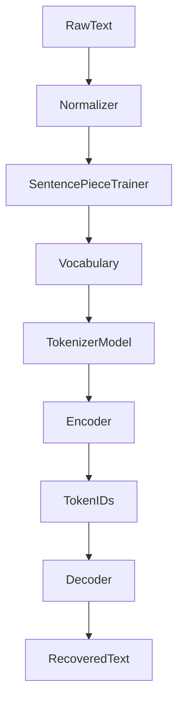

# Odyssey

### A decoder-only transformer specializing in long-horizon reasoning, software architecture, and autonomous software engineering.

*"Think before you build."*

---

**Status:** Research Project — Phase 1 complete  
**Language:** Python 3.12+  
**Framework:** PyTorch  
**Target Runtime:** [Phalanx Runtime](https://github.com/404khai/phalanx)  
**Architecture:** Decoder-only Transformer

---

## Repository Overview

Odyssey is a research repository for building a small, carefully engineered decoder-only language model optimized for **reasoning**, not autocomplete.

Phase 0 established engineering standards and research workflow.  
Phase 1 adds a **SentencePiece reference tokenizer** (research + training/encoding pipeline). This is **not** the final Odyssey tokenizer — Phase 2 implements custom BPE from first principles.



---

## Vision

Odyssey exists to explore what an AI model looks like when it is optimized not for code completion, but for **thinking like a senior software architect.**

Rather than competing on benchmark scores alone, Odyssey aims to become exceptionally capable at solving problems that require deliberate reasoning, planning, decomposition, and architectural judgment.

Odyssey should not merely generate code. It should understand **why** the code exists.

---

## Goals

- Deliberate reasoning before code generation
- Software architecture and systems design capability
- Reproducible research experiments
- Clear documentation of every architectural decision
- Small but excellent models (Tiny → Base → Pro → Max)

### Non-goals

- Fastest coding model
- Largest parameter count
- General internet chatbot
- Creative writing or image generation

---

## Tokenizer Overview

Phase 1 ships `tokenizer/sentencepiece/` as the reference implementation:

| Capability | Status |
| --- | --- |
| Config-driven training (`configs/tokenizer.yaml`) | Done |
| Unicode / whitespace normalization | Done |
| Special tokens (`<pad/bos/eos/unk/mask/system/user/assistant>`) | Done |
| Encode / decode / save / load | Done |
| Inspector CLI | Done |
| Stats (compression, unk rate, speed) | Done |
| Paper summaries | Done |
| Custom BPE (Odyssey-owned) | Phase 2 |

Architecture details: [docs/tokenizer/architecture.md](docs/tokenizer/architecture.md)

### Training Instructions

```bash
source venv/bin/activate

# Fetch TinyStories sample used by ODY-0001
python scripts/prepare_tinystories_sample.py --max-stories 50000

# Train reference SentencePiece model
python scripts/train.py \
  --input datasets/raw/sample.txt \
  --vocab-size 32000
```

### Usage Examples

```bash
# Inspect tokenization
python scripts/inspect_tokenizer.py \
  --model assets/tokenizer/odyssey.model \
  --text "Build authentication API" \
  --show-specials
```

```python
from tokenizer import OdysseySentencePieceTokenizer, load_tokenizer_config

tok = OdysseySentencePieceTokenizer(load_tokenizer_config())
tok.load("assets/tokenizer/odyssey.model")

ids = tok.encode("Build authentication API")
print(tok.decode(ids))
print(tok.inspect("Build authentication API").render())
```

---

## Architecture Vision

```
User → Parallax → Phalanx Server → Phalanx Runtime → Odyssey
```

Odyssey's responsibility is **reasoning**. Other models may execute. Odyssey plans.

| Layer | Role | Status |
| --- | --- | --- |
| Tokenizer | SentencePiece reference → custom BPE | Phase 1 / next Phase 2 |
| Embeddings | Token + RoPE positional encodings | Planned |
| Decoder | RMSNorm, MHA, SwiGLU blocks | Planned |
| Training | AdamW, schedulers, mixed precision | Planned |
| Evaluation | Perplexity + reasoning benchmarks | Planned |
| Alignment | Instruction tuning, DPO | Planned |

---

## Installation

Requires **Python 3.12+**:

```bash
cd odyssey
python3.12 -m venv venv
source venv/bin/activate
pip install --upgrade pip
pip install -e ".[dev]"
```

### Verify

```bash
pytest
black --check .
ruff check .
isort --check-only .
mypy odyssey model tokenizer training evaluation
```

---

## Repository Structure

```
odyssey/
├── configs/                 # default.yaml, tokenizer.yaml
├── datasets/raw|processed/  # corpora (gitignored; regenerate via scripts)
├── docs/tokenizer/          # architecture + SentencePiece notes
├── papers/                  # research summaries
├── experiments/             # ODY-XXXX logs
├── tokenizer/sentencepiece/ # Phase 1 reference implementation
├── scripts/train.py         # training CLI
├── scripts/inspect_tokenizer.py
├── assets/tokenizer/        # generated .model/.vocab
├── model/ training/ evaluation/ tests/
└── ...
```

---

## Repository Progress

| Phase | Focus | Status |
| --- | --- | --- |
| 0 | Repository setup & research foundation | **Complete** |
| 1 | Tokenizer research & SentencePiece pipeline | **Complete** |
| 2 | Custom Odyssey BPE tokenizer | Next |
| 3–9 | Embeddings → full decoder | Planned |
| 10–20 | Training → Odyssey v1 release | Planned |

Full plan: [ROADMAP.md](ROADMAP.md)

---

## Experiment Tracking

| ID | Purpose | Result |
| --- | --- | --- |
| ODY-0000 | Repository initialization | Successful |
| ODY-0001 | Baseline SentencePiece tokenizer | Successful |

Conventions: [experiments/README.md](experiments/README.md)

---

## Documentation Index

| Document | Purpose |
| --- | --- |
| [AGENTS.md](AGENTS.md) | Agent instructions and full phase specs |
| [ROADMAP.md](ROADMAP.md) | Phase-by-phase plan |
| [RESEARCH.md](RESEARCH.md) | Research questions and notes |
| [PAPERS.md](PAPERS.md) | Reading list |
| [EXPERIMENTS.md](EXPERIMENTS.md) | Experiment log |
| [MODEL_CARD.md](MODEL_CARD.md) | Model card (placeholders) |
| [CHANGELOG.md](CHANGELOG.md) | Version history |
| [tokenizer/README.md](tokenizer/README.md) | Tokenizer package docs |

---

## License

MIT — see [LICENSE](LICENSE).
