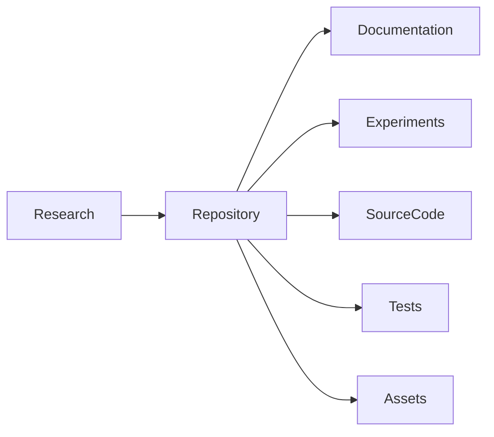

# Odyssey

### A decoder-only transformer specializing in long-horizon reasoning, software architecture, and autonomous software engineering.

*"Think before you build."*

---

**Status:** Research Project — Phase 0 complete  
**Language:** Python 3.12+  
**Framework:** PyTorch  
**Target Runtime:** [Phalanx Runtime](../runtime)  
**Architecture:** Decoder-only Transformer

---

## Repository Overview

Odyssey is a research repository for building a small, carefully engineered decoder-only language model optimized for **reasoning**, not autocomplete.

This phase establishes engineering standards, project structure, tooling, documentation, testing infrastructure, and research workflow. No model training is implemented yet.



---

## Vision

Odyssey exists to explore what an AI model looks like when it is optimized not for code completion, but for **thinking like a senior software architect.**

Rather than competing on benchmark scores alone, Odyssey aims to become exceptionally capable at solving problems that require deliberate reasoning, planning, decomposition, and architectural judgment.

Odyssey should not merely generate code. It should understand **why** the code exists.

---

## Goals

- Deliberate reasoning before code generation
- Software architecture and systems design capability
- Reproducible research experiments
- Clear documentation of every architectural decision
- Small but excellent models (Tiny → Base → Pro → Max)

### Non-goals

- Fastest coding model
- Largest parameter count
- General internet chatbot
- Creative writing or image generation

---

## Architecture Vision

```
User → Parallax → Phalanx Server → Phalanx Runtime → Odyssey
```

Odyssey's responsibility is **reasoning**. Other models may execute. Odyssey plans.

Planned stack:

| Layer | Role |
| --- | --- |
| Tokenizer | SentencePiece / custom BPE |
| Embeddings | Token + RoPE positional encodings |
| Decoder | RMSNorm, MHA, SwiGLU blocks |
| Training | AdamW, schedulers, mixed precision |
| Evaluation | Perplexity + reasoning benchmarks |
| Alignment | Instruction tuning, DPO |

---

## Installation

Requires **Python 3.12+**. If multiple Python versions are installed, create the venv explicitly:

```bash
cd odyssey
python3.12 -m venv venv
source venv/bin/activate
pip install --upgrade pip
pip install -e ".[dev]"
```

Or with `requirements.txt`:

```bash
pip install -r requirements.txt
pip install -e .
```

Optional experiment tooling:

```bash
pip install -e ".[tracking]"   # wandb, hydra-core
```

### Verify Phase 0

```bash
pytest
black --check .
ruff check .
isort --check-only .
mypy odyssey model tokenizer training evaluation
```

---

## Repository Structure

```
odyssey/
├── configs/           # YAML hyperparameters
├── datasets/
│   ├── raw/           # Immutable source data (gitignored)
│   └── processed/     # Derived datasets (gitignored)
├── docs/
│   ├── architecture/
│   ├── training/
│   ├── tokenizer/
│   └── evaluation/
├── papers/            # Reading notes / paper links
├── experiments/       # Experiment logs (ODY-XXXX)
├── model/             # Transformer components (future)
├── tokenizer/         # Tokenizer tooling (future)
├── training/          # Training loops (future)
├── evaluation/        # Benchmarks (future)
├── odyssey/           # Shared package utilities (config, etc.)
├── tests/
├── scripts/
├── assets/
├── .github/
├── AGENTS.md
├── ROADMAP.md
├── MODEL_CARD.md
├── CHANGELOG.md
├── PAPERS.md
├── EXPERIMENTS.md
├── RESEARCH.md
├── LICENSE
├── requirements.txt
└── pyproject.toml
```

---

## Future Roadmap

See [ROADMAP.md](ROADMAP.md) for all phases (0–20).

| Phase | Focus | Status |
| --- | --- | --- |
| 0 | Repository setup & research foundation | **Complete** |
| 1 | Tokenizer research | Next |
| 2–9 | Custom tokenizer → full decoder | Planned |
| 10–12 | Training, checkpointing, evaluation | Planned |
| 13–16 | Instruction tuning, DPO, SE data, reasoning eval | Planned |
| 17–20 | Optimization → Odyssey v1 release | Planned |

---

## Experiment Tracking

Experiments use IDs like `ODY-0000`. Conventions live in [experiments/README.md](experiments/README.md) and the log in [EXPERIMENTS.md](EXPERIMENTS.md).

| ID | Purpose | Result |
| --- | --- | --- |
| ODY-0000 | Repository initialization | Successful |

---

## Documentation Index

| Document | Purpose |
| --- | --- |
| [AGENTS.md](AGENTS.md) | Agent instructions and full phase specs |
| [ROADMAP.md](ROADMAP.md) | Phase-by-phase plan |
| [RESEARCH.md](RESEARCH.md) | Research questions and notes |
| [PAPERS.md](PAPERS.md) | Reading list |
| [EXPERIMENTS.md](EXPERIMENTS.md) | Experiment log |
| [MODEL_CARD.md](MODEL_CARD.md) | Model card (placeholders) |
| [CHANGELOG.md](CHANGELOG.md) | Version history |

---

## License

MIT — see [LICENSE](LICENSE).
