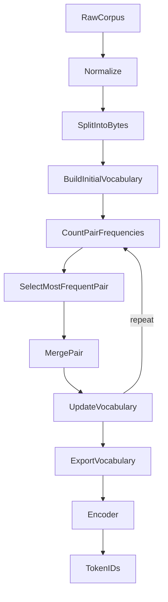

# Odyssey

### A decoder-only transformer specializing in long-horizon reasoning, software architecture, and autonomous software engineering.

*"Think before you build."*

---

**Status:** Research Project — Phase 2 complete  
**Language:** Python 3.12+  
**Framework:** PyTorch  
**Target Runtime:** [Phalanx Runtime](https://github.com/404khai/phalanx)  
**Architecture:** Decoder-only Transformer

---

## Repository Overview

Odyssey is a research repository for building a small, carefully engineered decoder-only language model optimized for **reasoning**, not autocomplete.

| Phase | Deliverable |
| --- | --- |
| 0 | Research repository foundation |
| 1 | SentencePiece **reference** tokenizer |
| 2 | **Owned** byte-level BPE library (`odyssey_tokenizer`) |



---

## Odyssey Tokenizer

The tokenizer is a **reusable library**, not model-coupled code:

```
tokenizer/
├── odyssey_tokenizer/   # import odyssey_tokenizer
├── cli/                 # odyssey-tokenizer
├── benchmarks/
├── tests/
├── docs/
└── sentencepiece/       # Phase 1 reference only
```

### Public API

```python
from odyssey_tokenizer import OdysseyTokenizer

tokenizer = OdysseyTokenizer.load("assets/tokenizer/bpe/odyssey.model")
ids = tokenizer.encode("Build authentication API")
text = tokenizer.decode(ids)
```

Training and Phalanx Runtime can share the same artifacts (`vocab.json` + `merges.txt`). A future Rust port should preserve identical behavior.

### Training

```bash
source venv/bin/activate
python scripts/prepare_tinystories_sample.py --max-stories 50000

odyssey-tokenizer train \
  --input datasets/raw/sample.txt \
  --vocab-size 2048 \
  --max-lines 1000 \
  --output assets/tokenizer/bpe/odyssey.model
```

### CLI Usage

```bash
odyssey-tokenizer encode --model assets/tokenizer/bpe/odyssey.model --text "Hello"
odyssey-tokenizer decode --model assets/tokenizer/bpe/odyssey.model --ids 12,45,90
odyssey-tokenizer inspect --model assets/tokenizer/bpe/odyssey.model --text "Build authentication API" --show-merges
odyssey-tokenizer benchmark --model assets/tokenizer/bpe/odyssey.model --input datasets/raw/sample.txt --limit 200
odyssey-tokenizer visualize --model assets/tokenizer/bpe/odyssey.model --input datasets/raw/sample.txt
```

### Merge Algorithm

Greedy byte-pair merges with deterministic tie-breaking. Details:
[tokenizer/docs/merge_algorithm.md](tokenizer/docs/merge_algorithm.md)

### Benchmarks (ODY-0002)

| Metric | Value (2048 vocab / 1000 TinyStories lines) |
| --- | --- |
| Compression | ~4.16 chars/token (~76% reduction) |
| Unknown rate | 0.0 |
| Train time | ~157 s |
| Encode / decode | ~1e3 tok/s encode · ~6e6 tok/s decode |

### Comparison

| | Odyssey BPE | SentencePiece (Phase 1) | GPT-2 BPE |
| --- | --- | --- | --- |
| Ownership | First-party | Third-party C++ | Third-party reference |
| Alphabet | Bytes | Unigram pieces | Bytes + unicode map |
| Runtime dependency | None (Python) | `sentencepiece` | `tiktoken` / HF |
| Phalanx path | Direct / Rust port | Not required | Study only |

### Future Rust Port

Phalanx Runtime should eventually load the same `merges.txt` / `vocab.json` (or a mirrored binary) so train/serve tokenization never drifts.

Docs: [tokenizer/README.md](tokenizer/README.md)

---

## Vision

Odyssey exists to explore what an AI model looks like when it is optimized not for code completion, but for **thinking like a senior software architect.**

---

## Goals

- Deliberate reasoning before code generation
- Software architecture and systems design capability
- Reproducible research experiments
- Clear documentation of every architectural decision
- Small but excellent models (Tiny → Base → Pro → Max)

---

## Installation

```bash
cd odyssey
python3.12 -m venv venv
source venv/bin/activate
pip install -e ".[dev]"
```

### Verify

```bash
pytest
black --check .
ruff check .
isort --check-only .
mypy odyssey model tokenizer training evaluation
MYPYPATH=tokenizer mypy --explicit-package-bases -p odyssey_tokenizer
```

---

## Repository Progress

| Phase | Focus | Status |
| --- | --- | --- |
| 0 | Repository setup | **Complete** |
| 1 | SentencePiece reference | **Complete** |
| 2 | Odyssey BPE library | **Complete** |
| 3 | Embedding layer | Next |
| 4–20 | RoPE → Odyssey v1 | Planned |

---

## Experiment Tracking

| ID | Purpose | Result |
| --- | --- | --- |
| ODY-0000 | Repository initialization | Successful |
| ODY-0001 | SentencePiece baseline | Successful |
| ODY-0002 | Odyssey BPE tokenizer | Successful |

---

## License

MIT — see [LICENSE](LICENSE).
