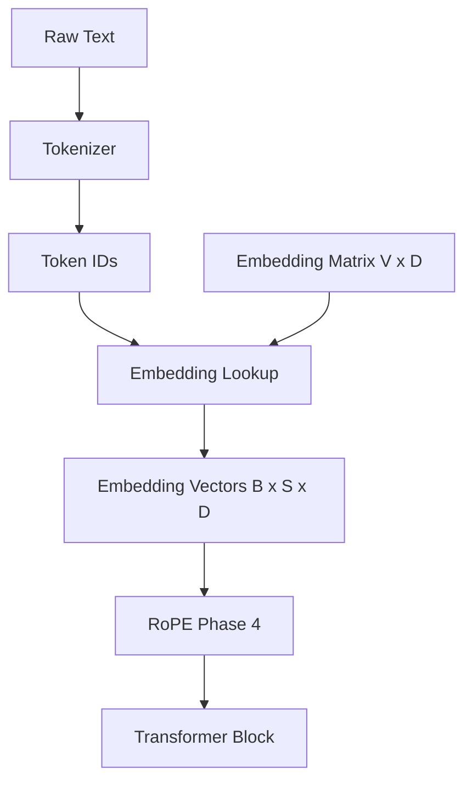

# Token Embeddings

## What embeddings are

Neural nets cannot reason about raw integer token ids. An **embedding** maps each id \(t\) to a dense vector \(E[t] \in \mathbb{R}^{D}\).

The table \(E \in \mathbb{R}^{V \times D}\) is a trainable parameter matrix: one row per vocabulary entry.



## Lookup tables

Forward pass is an indexed gather — **not** a matmul:

```text
x = E[t]
```

PyTorch: `nn.Embedding`. Odyssey: `model.OdysseyEmbedding`.

## Training

Rows start random (Normal / Xavier / Kaiming). Backpropagation updates only rows touched by the batch (plus any tied head later). Similar tokens tend to cluster as the LM objective runs.

## Initialization

| Strategy | Role |
| --- | --- |
| `normal` | GPT-style \(\mathcal{N}(0, \sigma^2)\), default σ=`init_std` |
| `xavier_*` | Glorot; **Odyssey default** (`xavier_uniform`) |
| `kaiming_*` | He; better when feeding ReLU-family maps |

See `model/initialization.py` and [math/embeddings.md](../../math/embeddings.md).

## Weight tying (future)

Input embeddings and the output projection often share weights in GPT-style models:

```text
Input E  ←→  Output projection (tied)
```

Saves \(V \times D\) parameters. **Not implemented in Phase 3** — documented only.

## Memory usage

\[
\mathrm{params} = V \times D
\]

Example: \(32000 \times 768 = 24{,}576{,}000\) parameters ≈ **93.75 MiB** at float32.

## Shape contract

| Tensor | Shape |
| --- | --- |
| Input ids | `(batch, sequence)` |
| Output | `(batch, sequence, hidden_size)` |
| Weight | `(vocab_size, hidden_size)` |

## Code entrypoints

```python
from model import EmbeddingConfig, OdysseyEmbedding, load_embedding_config

config = load_embedding_config()
emb = OdysseyEmbedding(config)
x = emb(token_ids)  # (B, S, D)
print(emb.inspect().format())
```

Math note: [math/embeddings.md](../../math/embeddings.md)  
Phalanx inference twin: `runtime/src/layers/embedding.rs`
