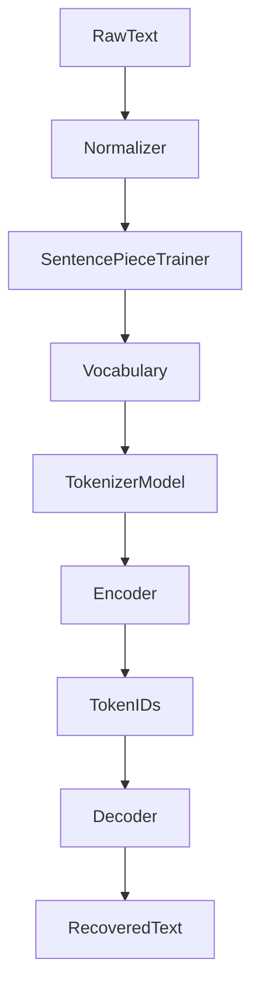

# Tokenizer Architecture (Phase 1)

Odyssey Phase 1 uses **SentencePiece** as a reference tokenizer. The goal is deep understanding and a production-quality training/encoding pipeline before Phase 2 implements custom BPE from scratch.

---

## Pipeline



---

## Components

| Module | Responsibility |
| --- | --- |
| `normalizer.py` | NFKC, whitespace collapse, newline preservation |
| `trainer.py` | Wraps `SentencePieceTrainer.train` with Odyssey config/specials |
| `tokenizer.py` | Public `train/encode/decode/save/load/inspect/stats` API |
| `encoder.py` | Text → IDs / pieces |
| `decoder.py` | IDs / pieces → text |
| `special_tokens.py` | Reserved token documentation and surfaces |
| `config.py` | Loads `configs/tokenizer.yaml` |

---

## Vocabulary Generation

1. Load corpus (`datasets/raw/sample.txt`).
2. Normalize offline (optional but default).
3. Train Unigram (default) or BPE with configured `vocab_size`.
4. Emit:
   - `.model` — binary SentencePiece model
   - `.vocab` — piece / score table
   - `metadata.json` — config snapshot + training metrics

Core control IDs are fixed:

| ID | Piece |
| --- | --- |
| 0 | `<pad>` |
| 1 | `<bos>` |
| 2 | `<eos>` |
| 3 | `<unk>` |

Chat/role symbols (`<mask>`, `<system>`, `<user>`, `<assistant>`) are `user_defined_symbols`.

---

## Encoding

```
text → normalize → SentencePiece.encode → List[int]
```

Optional `add_bos` / `add_eos` prepend/append configured IDs.

---

## Decoding

```
List[int] → SentencePiece.decode → text
```

`skip_special_ids` can drop pad/bos/eos for display.

---

## Training

```bash
python scripts/train.py --input datasets/raw/sample.txt --vocab-size 32000
```

Training hyperparameters come from YAML unless overridden by CLI flags.

---

## Inspection

```bash
python scripts/inspect_tokenizer.py \
  --text "Build authentication API"
```

Shows Input → Tokens → IDs → Decoded Text.

---

## Future BPE Implementation (Phase 2)

Phase 2 replaces SentencePiece internals with `OdysseyTokenizer`:

- Own merge-table trainer
- Vocabulary export owned by Odyssey
- Merge-rule visualization
- Eventually a Rust/serving path in Phalanx Runtime

The Phase 1 public methods (`train/encode/decode/save/load`) are the behavioral contract the custom BPE should match.
