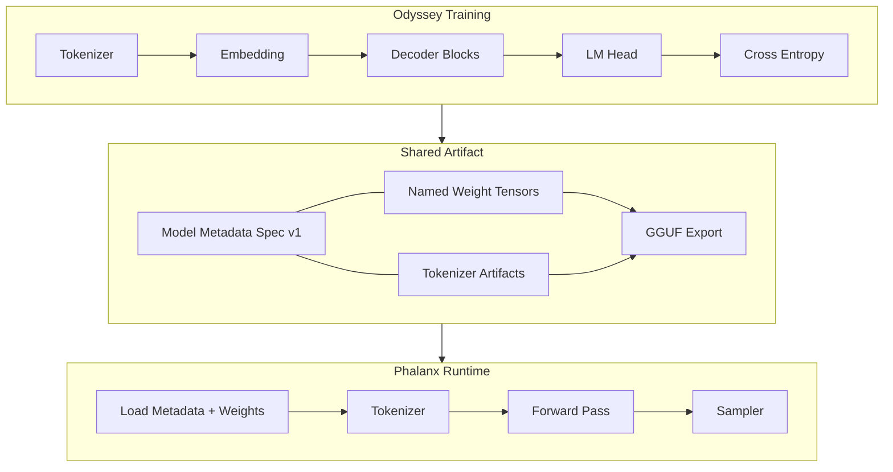

# Odyssey Specification

**Version:** `1.0.0`  
**Status:** Frozen contract (Version 1)  
**Date:** 2026-07-28  
**Authority:** This directory is the single source of truth for the Odyssey model family.

---

## Purpose

Odyssey (training) and Phalanx Runtime (inference) evolve together.

| Repository | Role |
| --- | --- |
| **Odyssey** | Defines and trains the model |
| **Phalanx Runtime** | Reference inference implementation for Odyssey |

They are to Odyssey what PyTorch and llama.cpp are to a shared model family: same mathematics, same tensor names, same shapes, different execution environments.

**Do not** invent architecture in the runtime. **Do not** silently diverge weight names or residual order in training.

---

## Specification Version

```text
odyssey.spec.version = 1.0.0
```

| Rule | Detail |
| --- | --- |
| Breaking change | Increment major (`2.0.0`) — requires dual support or migration |
| Additive / clarifying | Increment minor (`1.1.0`) |
| Typos / non-semantic edits | Increment patch (`1.0.1`) |

Phalanx Runtime **must** declare which spec versions it supports (see `runtime/docs/compatibility.md`).

---

## Document Index

| Document | Topic |
| --- | --- |
| [architecture.md](architecture.md) | Model family, config keys, residual order |
| [tensor_shapes.md](tensor_shapes.md) | Every tensor shape, layout, producer/consumer |
| [tokenizer.md](tokenizer.md) | Encode/decode/save/load contract |
| [weight_layout.md](weight_layout.md) | Frozen parameter names |
| [gguf_mapping.md](gguf_mapping.md) | Odyssey name → GGUF → Phalanx |
| [forward_pass.md](forward_pass.md) | End-to-end inference / train forward |
| [rope.md](rope.md) | Rotary positional embeddings |
| [rmsnorm.md](rmsnorm.md) | RMS normalization |
| [attention.md](attention.md) | Causal multi-head / GQA attention |
| [feedforward.md](feedforward.md) | SwiGLU FFN |
| [kv_cache.md](kv_cache.md) | Prefill / decode cache |
| [sampling.md](sampling.md) | Logits → token |
| [serialization.md](serialization.md) | Checkpoints, GGUF export, metadata |
| [runtime_contract.md](runtime_contract.md) | Odyssey ↔ Phalanx guarantees |
| [compatibility.md](compatibility.md) | Versioning and change policy |

Pedagogical math companions (not normative): [`../math/`](../math/README.md).

---

## Design Principles

1. **Model first** — specs describe tensors and algorithms, not languages.
2. **Metadata over inference** — the runtime never guesses architecture.
3. **Frozen names** — weight identifiers do not rename after Spec v1.
4. **Train / serve parity** — same residual order, norms, RoPE, and activations.
5. **Llama-family layout** — GGUF export targets the Llama tensor convention for ecosystem tooling.

---

## Tiny Reference Config (normative defaults)

Values used by Odyssey Tiny unless an experiment overrides them via metadata:

| Key | Default |
| --- | --- |
| `vocab_size` | `32000` |
| `hidden_size` | `768` |
| `intermediate_size` | `2048` |
| `num_layers` | `12` |
| `num_heads` | `12` |
| `num_kv_heads` | `12` |
| `head_dim` | `64` (`hidden_size / num_heads`) |
| `context_length` | `2048` |
| `rope_theta` | `10000.0` |
| `rope_scaling` | `none` |
| `rms_norm_eps` | `1e-6` |
| `activation` | `swiglu` |
| `norm_type` | `rmsnorm` |
| `attention_layout` | `pre_norm` |
| `weight_tying` | `false` (optional `true` later) |
| `dtype_train` | `float32` (mixed precision optional) |
| `dtype_serve` | as stored in GGUF |

---

## Overall Architecture



---

## Change Control

Any architectural change requires:

1. Spec document update with version bump
2. Odyssey training code alignment (when the component exists)
3. Phalanx Runtime compliance matrix update
4. Explicit dual-version support if breaking
