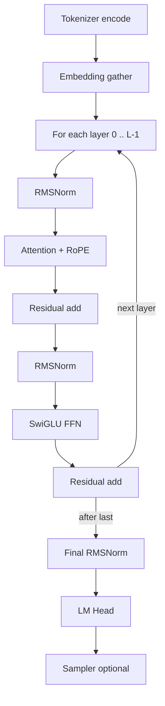

# Forward Pass

**Spec:** Odyssey Specification `1.0.0`  
**Normative:** Yes

---

## Purpose

Specify the complete causal LM forward computation from tokens to logits (and optionally to a sampled token).

---

## Theory

Inference and training share the same core graph. Training adds cross-entropy on logits; inference adds sampling. KV cache changes only the attention inputs during decode, not the mathematical definition of a layer.

---

## Pipeline



---

## Steps

### 1. Tokenizer

- **Input:** text (or chat-structured text)
- **Output:** `token_ids` shape `(B, S)` or `(S,)`
- **Purpose:** Discrete vocabulary indices

### 2. Embedding

\[
X^{(0)}_{b,s,:} = E[\mathrm{token\_ids}_{b,s}]
\]

- **Input:** `(B, S)` int
- **Output:** `(B, S, D)` float
- **Purpose:** Dense residual stream

### 3. Decoder layer \(i\) (pre-norm)

\[
\begin{aligned}
a &= \mathrm{Attn}_i(\mathrm{RMSNorm}(X^{(i)}; \gamma_{a,i})) \\
U &= X^{(i)} + a \\
f &= \mathrm{FFN}_i(\mathrm{RMSNorm}(U; \gamma_{f,i})) \\
X^{(i+1)} &= U + f
\end{aligned}
\]

RoPE is applied inside \(\mathrm{Attn}\) to Q/K using absolute positions (prefill: `0..S-1`; decode: cache length offset).

### 4. Final norm + LM head

\[
\begin{aligned}
H &= \mathrm{RMSNorm}(X^{(L)}; \gamma_{\mathrm{final}}) \\
\mathrm{logits} &= H W_U^\top
\end{aligned}
\]

If `weight_tying`, \(W_U = E\).

### 5. Sampler (inference)

Maps last-position logits `(V,)` → next token id.

---

## Tensor Shapes

| Stage | Shape |
| --- | --- |
| Token ids | `(B, S)` |
| Residual | `(B, S, D)` |
| Logits | `(B, S, V)` train / last token `(V,)` decode |

---

## Prefill vs Decode

| Mode | Sequence | KV cache |
| --- | --- | --- |
| Prefill | Full prompt \(S\) | Write K/V for all positions |
| Decode | Usually \(S=1\) | Append one K/V; attend to \(T\) |

---

## Implementation Notes

- Language-agnostic; Odyssey trains this graph; Phalanx executes it for serving.
- Partial runtime implementations must still respect step order when composing kernels.

---

## Examples

Tiny prefill \(B=1,S=128,D=768\):

```text
ids (1,128) → hidden (1,128,768) → … → logits (1,128,32000)
```

---

## Future Extensions

- Speculative decoding draft/verify (does not change layer math)
- Parallel residual variants (breaking → Spec 2)

---

## Compatibility Notes

See component specs: [rope.md](rope.md), [rmsnorm.md](rmsnorm.md), [attention.md](attention.md), [feedforward.md](feedforward.md), [kv_cache.md](kv_cache.md), [sampling.md](sampling.md).
