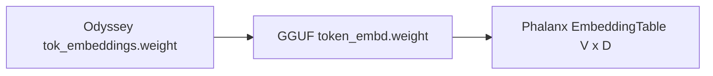

# GGUF Mapping

**Spec:** Odyssey Specification `1.0.0`  
**Normative:** Yes

---

## Purpose

Bijection between Odyssey logical weights, GGUF tensor names, and Phalanx Runtime bindings.

```text
Odyssey Weight  →  GGUF Tensor Name  →  Phalanx Tensor
```

---

## Theory

GGUF is the interchange container for serving. Odyssey may train in native checkpoints; export **must** emit the mapping below so Phalanx (and llama.cpp-compatible tools) can load models.

Spec v1 targets **Llama-compatible GGUF tensor names** even though the logical architecture string in Odyssey metadata is `odyssey`. Export may set `general.architecture = llama` for tooling compatibility while embedding `odyssey.spec.version` in metadata (see [serialization.md](serialization.md)).

---

## Mapping Table

| Odyssey logical name | GGUF tensor name | Phalanx binding |
| --- | --- | --- |
| `tok_embeddings.weight` | `token_embd.weight` | `EmbeddingTable` / `TOKEN_EMBD_WEIGHT` |
| `layers.{i}.attention_norm.weight` | `blk.{i}.attn_norm.weight` | Future `RMSNorm` |
| `layers.{i}.attention.wq.weight` | `blk.{i}.attn_q.weight` | Future attention |
| `layers.{i}.attention.wk.weight` | `blk.{i}.attn_k.weight` | Future attention |
| `layers.{i}.attention.wv.weight` | `blk.{i}.attn_v.weight` | Future attention |
| `layers.{i}.attention.wo.weight` | `blk.{i}.attn_output.weight` | Future attention |
| `layers.{i}.ffn_norm.weight` | `blk.{i}.ffn_norm.weight` | Future `RMSNorm` |
| `layers.{i}.feed_forward.w1.weight` | `blk.{i}.ffn_gate.weight` | Future FFN (gate) |
| `layers.{i}.feed_forward.w3.weight` | `blk.{i}.ffn_up.weight` | Future FFN (up) |
| `layers.{i}.feed_forward.w2.weight` | `blk.{i}.ffn_down.weight` | Future FFN (down) |
| `norm.weight` | `output_norm.weight` | Future final norm |
| `output.weight` | `output.weight` | Future LM head |

When `weight_tying=true`, GGUF may omit `output.weight`; Phalanx must reuse `token_embd.weight`.

---

## Metadata Key Mapping

| Odyssey config key | GGUF key (Llama arch) |
| --- | --- |
| `num_layers` | `llama.block_count` |
| `context_length` | `llama.context_length` |
| `hidden_size` | `llama.embedding_length` |
| `intermediate_size` | `llama.feed_forward_length` |
| `vocab_size` | `llama.vocab_size` (optional if embd/tokenizer imply it) |
| `num_heads` | `llama.attention.head_count` |
| `num_kv_heads` | `llama.attention.head_count_kv` |
| `head_dim` | `llama.attention.key_length` (and value_length) |
| `rms_norm_eps` | `llama.attention.layer_norm_rms_epsilon` |
| `rope_dim` | `llama.rope.dimension_count` |
| `rope_theta` | `llama.rope.freq_base` |
| `rope_scaling` | `llama.rope.scaling.*` / legacy `llama.rope.scale` |

Additional required Odyssey metadata:

| Key | Storage |
| --- | --- |
| `odyssey.spec.version` | GGUF KV (string) preferred; else sidecar JSON |
| `odyssey.weight_tying` | GGUF KV (bool) |
| `odyssey.activation` | GGUF KV (`swiglu`) |
| `odyssey.tokenizer_format` | GGUF KV (`odyssey-bpe`) |

---

## Layout Note (embeddings)

GGUF stores `token_embd.weight` with ggml dims `[n_embd, n_vocab]`. Byte order is already vocab-major rows. Phalanx reinterprets to `[V, D]` without copy — matching Odyssey `(V, D)`.

---

## Diagram



---

## Implementation Notes

- Phalanx currently binds **only** `token_embd.weight`.
- Exporters must not invent alternate GGUF names for Spec v1 tensors.
- Tokenizer tokens/merges embed via `tokenizer.ggml.*` keys (see [tokenizer.md](tokenizer.md)).

---

## Examples

```text
tok_embeddings.weight  →  token_embd.weight  →  EmbeddingTable
layers.2.attention.wq.weight  →  blk.2.attn_q.weight
layers.2.feed_forward.w1.weight  →  blk.2.ffn_gate.weight
```

---

## Future Extensions

- Odyssey-native GGUF architecture id `odyssey` (requires ecosystem support)
- Quantization-specific suffix conventions (`*.weight` + `.weight_scale` …)

---

## Compatibility Notes

Any Phalanx loader that accepts Odyssey exports must use this table. Hardcoded names outside the table are non-compliant.
