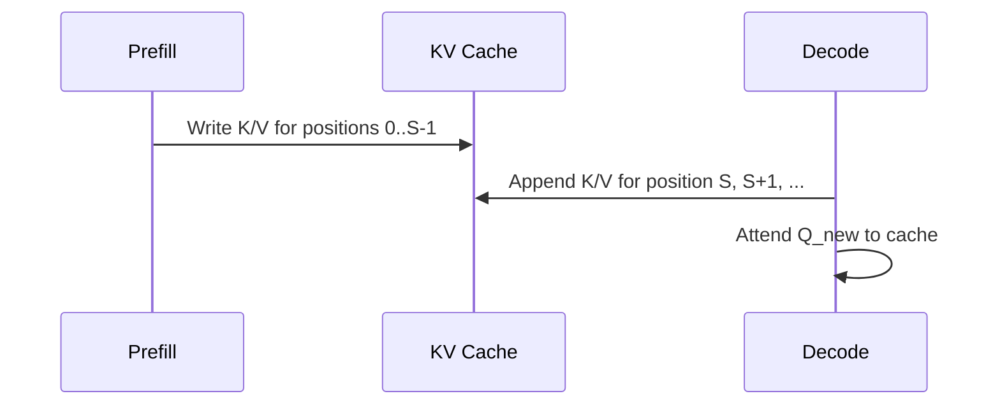

# KV Cache

**Spec:** Odyssey Specification `1.0.0`  
**Normative:** Yes (inference)

---

## Purpose

Avoid recomputing key/value projections for past tokens during autoregressive decode.

---

## Theory

Causal attention at step \(t\) only needs \(K_{0:t}, V_{0:t}\). Caching them turns decode from \(O(t^2)\) full recompute toward \(O(t)\) incremental work per new token (plus attention against cached length).

---

## Mathematics

After projecting and RoPE-rotating the new token’s K/V at position \(t\):

\[
K^{\mathrm{cache}} \leftarrow \mathrm{concat}(K^{\mathrm{cache}}, K_t),\quad
V^{\mathrm{cache}} \leftarrow \mathrm{concat}(V^{\mathrm{cache}}, V_t)
\]

Attention uses full cached K/V; Q is only the new token (decode).

RoPE positions must match absolute indices used at prefill.

---

## Tensor Shapes

| Tensor | Shape |
| --- | --- |
| `cache_k[layer]` | `(B, H_kv, T, d)` |
| `cache_v[layer]` | `(B, H_kv, T, d)` |

\(T \le\) `context_length`. Overflow is a hard error unless a documented sliding-window extension exists (not in Spec v1).

---

## Prefill / Decode

---

## Implementation Notes

- Training typically does not persist KV cache across steps (full parallel attention).
- Runtime owns cache lifetime and device placement.
- Dtype of cache may match compute dtype; must be documented per build.

---

## Examples

After prompt length 128, decode step 0: \(T=128\) before append, then \(T=129\).

---

## Future Extensions

- Paged KV / prefix caching
- Sliding window eviction

---

## Compatibility Notes

Cache layout may be implementation-defined **physically**, but logical shape and RoPE position semantics are normative.
