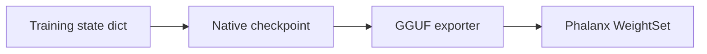

# Serialization

**Spec:** Odyssey Specification `1.0.0`  
**Normative:** Yes

---

## Purpose

Define how Odyssey models and tokenizers are persisted for training resume and inference export.

---

## Theory

Two audiences:

1. **Training** — fast resume, optimizer state, experiment ids  
2. **Serving** — GGUF (+ metadata) consumed by Phalanx

Both must carry Spec version and architecture hyperparameters so the runtime never infers structure.

---

## Training Checkpoint (logical)

Required contents:

| Item | Requirement |
| --- | --- |
| `spec_version` | `1.0.0` |
| Model config keys | From [architecture.md](architecture.md) |
| Weights | Named per [weight_layout.md](weight_layout.md) |
| Tokenizer ref | Path or embedded `odyssey-bpe` artifacts |
| RNG / step | For resume (training-only) |

Exact binary format (`.pt`, safetensors, …) is implementation-defined; **names and shapes are not**.

---

## GGUF Export

Must include:

1. Tensor digests named per [gguf_mapping.md](gguf_mapping.md)
2. Llama-compatible hparam keys
3. Tokenizer `tokenizer.ggml.*`
4. Odyssey KV metadata:

```text
odyssey.spec.version = "1.0.0"
odyssey.weight_tying = true|false
odyssey.activation = "swiglu"
odyssey.tokenizer_format = "odyssey-bpe"
odyssey.tokenizer_version = 1
```

---

## Diagram



---

## Implementation Notes

- Export tools validate: every required weight present XOR tying rules; shapes match config; tokenizer vocab size consistent with embedding rows.
- Phalanx rejects missing architecture keys (`ModelError::MissingKey`).

---

## Examples

Tiny export embeds `token_embd.weight` with shape metadata `[768, 32000]` ggml order and `llama.embedding_length=768`.

---

## Future Extensions

- Sharded GGUF
- Safetensors dual-publish

---

## Compatibility Notes

A GGUF without `odyssey.spec.version` may still load as generic Llama **only** if all required Llama keys exist; Phalanx should warn. Odyssey-branded releases **must** include the KV.
