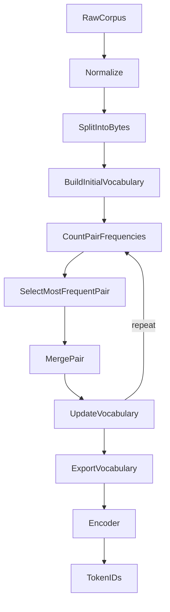

# Tokenizer Architecture (Library)



## Package boundary

```
odyssey_tokenizer.OdysseyTokenizer
        ↑
 training / evaluation / future Phalanx Runtime
```

SentencePiece remains under `tokenizer/sentencepiece/` as a reference implementation only.
